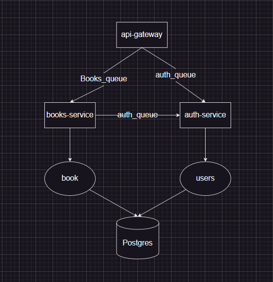
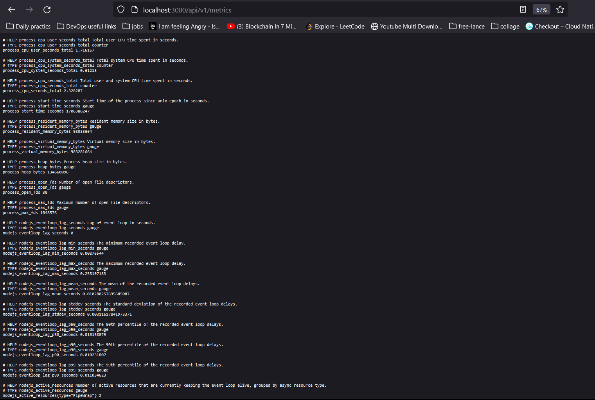
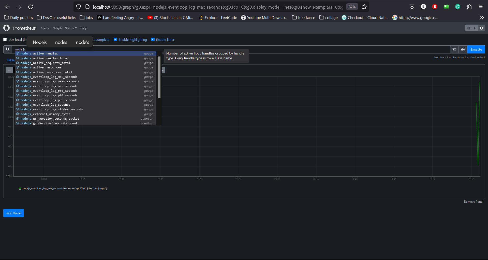

<p align="center">
  <a href="http://nestjs.com/" target="blank"></a>
</p>

[circleci-image]: https://img.shields.io/circleci/build/github/nestjs/nest/master?token=abc123def456
[circleci-url]: https://circleci.com/gh/nestjs/nest

  <h2 align="center">MicroService Club Api</h2>

# Description

This project is an MicroService Club Api with authentiction , authorization. its a club for reading and writing books each user can register to have it's account with his location on the Maps, and make crud operation on the books of his own. each user have 2 lists:

- read list: the books that the user read
- write list: the books that the user wrote

he can do crud operations on the books in his lists and he can add books to his lists by searching for the book by title or author and then add it to his Reading list.


# The project uses the following technologies:

- Backend Framework: Node.js
- Language: TypeScript
- Server Framework: NestJS
- queue manager: RabbitMQ
- monitoring: Prometheus (cadvisor - nodejs promClient - node-exporter) and Grafana
- containerization: Docker
- container orchestration: Kubernetes & Helm
- CI/CD: Github Actions
- Database: PostgreSQL
- Authentication Middlewares: PassportJS
- Token Generation: JWT

# Getting Started

# Architecture

## arch diagram


## the arch consists of 3 services:

- auth service: responsible for authentication and authorization
- books service: responsible for books CRUD operations
- users service: responsible for users CRUD operations

### the communication between the services is done using RabbitMQ queues

### the communication between the services and the database is done using TypeORM and PostgreSQL

# Running the application

## Clone the repository

```bash
  git clone https://github.com/Waer1/microservice-books-club
  cd microservice-books-club
```

## Prerequisites

Before you can run this app, you need to have a PostgreSQL database set up. Create a database and add the database information to a `.env` file in the root of the project. Here's an example of what your `.env` file should look like:

```dotenv
NODE_ENV=development

# Postgres DB
DB_HOST=postgres
DB_PORT=5432
DB_USERNAME=postgres
DB_PASSWORD=postgres
DB_NAME=books-db

# PostGres Auth DB
POSTGRES_USER=postgres
POSTGRES_PASSWORD=postgres
POSTGRES_DB=books-db

# PGADMIN
PGADMIN_DEFAULT_EMAIL=waer@gmail.com
PGADMIN_DEFAULT_PASSWORD=postgres

# JWT
JWT_SECRET=secret
JWT_EXPIRATION=15d
BCRYPT_SALT=12

# RabbitMQ
RABBITMQ_DEFAULT_USER=user
RABBITMQ_DEFAULT_PASS=password
RABBITMQ_USER=user
RABBITMQ_PASS=password
RABBITMQ_HOST=rabbitmq:5672

# RabbitMQ Queues
RABBITMQ_AUTH_QUEUE=auth_queue
RABBITMQ_BOOKS_QUEUE=books_queue

# geocodio api key
GEOCODIO_API_KEY='GEOCODIO_API_KEY'

```

In this .env file:

## Required for the node application
- `DB_HOST` is the host of your PostgreSQL database
- `DB_PORT` is the port of your PostgreSQL database
- `DB_USERNAME` is the username of your PostgreSQL database
- `DB_PASSWORD` is the password of your PostgreSQL database
- `DB_NAME` is the name of your PostgreSQL database
- `RABBITMQ_HOST` is the host of your RabbitMQ
- `RABBITMQ_USER` is the username of your RabbitMQ
- `RABBITMQ_PASS` is the password of your RabbitMQ
- `RABBITMQ_AUTH_QUEUE` is the name of the queue for auth service
- `RABBITMQ_BOOKS_QUEUE` is the name of the queue for books service
- `RABBITMQ_USERS_QUEUE` is the name of the queue for users service

### Required for the PostgreSQL database
- `POSTGRES_USER` is the username of your PostgreSQL database
- `POSTGRES_PASSWORD` is the password of your PostgreSQL database
- `POSTGRES_DB` is the name of your PostgreSQL database

### Required for the RabbitMQ
- `RABBITMQ_DEFAULT_USER` is the username of your RabbitMQ
- `RABBITMQ_DEFAULT_PASS` is the password of your RabbitMQ

### Required for the PGADMIN
- `PGADMIN_DEFAULT_EMAIL` is the email of your PGADMIN
- `PGADMIN_DEFAULT_PASSWORD` is the password of your PGADMIN

### Required for the JWT & Authentication
- `JWT_SECRET` is the secret key for JWT
- `JWT_EXPIRATION` is the expiration time for JWT
- `BCRYPT_SALT` is the salt for bcrypt

### Required for the geocodio api
- `GEOCODIO_API_KEY` is the api key for geocodio api

#### IMPORTANT NOTE: before running the app you need to add the envs to the .env file in the root of the project

## Running with Docker using Docker Hub image

You can run the app by pulling the Docker image from Docker Hub and then running the container.

```bash
  docker-compose -f docker-compose.prod.yaml up
```

this will pull the image from docker hub and run it on your machine.

now you can access the app on http://localhost:3000/ and have look at postman collection to test the api

## Running by building Docker images using local code

You can run the app by building the Docker image and then running the container.
you can do this by running

```bash
  docker-compose -f docker-compose.yaml up
```

now you can access the app on http://localhost:3000/ and have look at postman collection to test the api


## setup the monitoring and logging

you can setup the monitoring and logging by running the following command

```bash
  cd .\monitoring
    docker-compose -f docker-compose.yaml up
```

now you can access promtheus on http://localhost:9090/ and grafana on http://localhost:3010/ also test the nodejs metrics on http://localhost:3000/api/v1/metrics
with user name and password for grafana is waer and waer






## setup using helm

you can setup the app using helm by running the following command

```bash
    cd .\my-books-club-chart\
    helm install books-club .
```

```bash
  kubeclt get all -n books-club
```

this deploy assume you already have postgresql and rabbitmq running on your cluster and you will update its values in values file to match your cluster


## Testing the application

have a look at postman collection to test the api

# Possible improvements
  - split the auth service into 2 services (auth service and users service)
  - add a service for the monitoring and logging
  - add a service for the geocodio api
